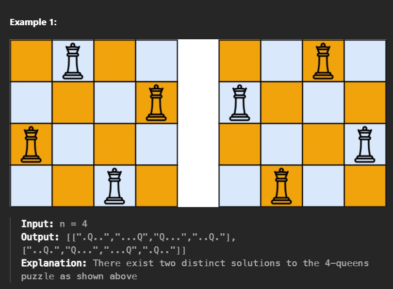

## N-Queens Puzzle

The **N-Queens puzzle** is the problem of placing `n` queens on an `n x n` chessboard such that no two queens attack each other.

### Problem Statement

Given an integer `n`, return all distinct solutions to the N-Queens puzzle. You may return the answer in any order.

Each solution contains a distinct board configuration of the N-Queens' placement, where:

- `'Q'` indicates a queen.
- `'.'` indicates an empty space.

    

